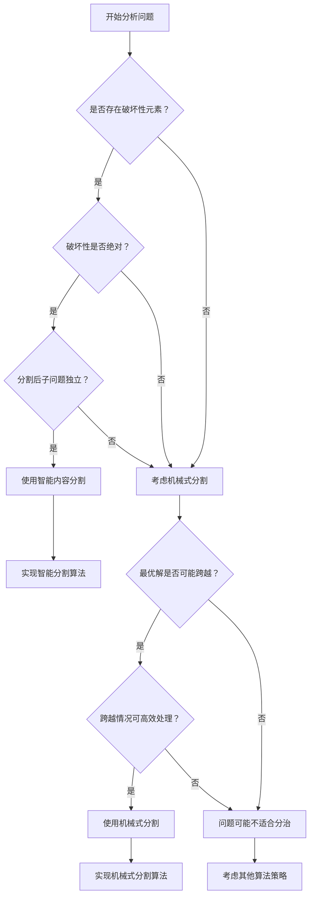

# 数组分治算法设计诀窍与分割点推导

分治算法是解决复杂问题的重要策略，其核心在于"分而治之"——将大问题分解为小问题，递归求解后合并结果。然而，**如何选择合适的分割点**是分治算法设计的关键，不同的分割策略会导致截然不同的算法复杂度和实现难度。

## 一、分治算法的两种基本模式

### 1.1 机械式均匀分割（经典模式）

**特点**：
- 按照固定规则（如中点）进行分割
- 分割点与问题内容无关
- 需要处理跨越分割点的情况

**典型应用**：
- 归并排序
- 快速排序
- 最大子数组和（股票问题）
- 矩阵乘法

**模板结构**：
```java
public ResultType divideAndConquer(int[] arr, int left, int right) {
    // 基础情况
    if (left >= right) {
        return baseCase(arr, left, right);
    }
    
    // 机械式分割
    int mid = left + (right - left) / 2;
    
    // 递归求解子问题
    ResultType leftResult = divideAndConquer(arr, left, mid);
    ResultType rightResult = divideAndConquer(arr, mid + 1, right);
    
    // 关键：处理跨越分割点的情况
    ResultType crossResult = handleCrossCase(arr, left, mid, right);
    
    // 合并结果
    return merge(leftResult, rightResult, crossResult);
}
```

### 1.2 智能内容分割（问题驱动模式）

**特点**：
- 根据问题特性选择分割点
- 分割点通常是"问题元素"或"障碍元素"
- 无需处理跨越情况（天然不可能跨越）

**典型应用**：
- 字符频次问题
- 区间调度问题
- 某些字符串匹配问题

**模板结构**：
```java
public ResultType smartDivideAndConquer(String s, int start, int end, int constraint) {
    // 基础情况
    if (start > end) {
        return baseCase();
    }
    
    // 智能寻找分割点
    List<Integer> splitPoints = findProblemElements(s, start, end, constraint);
    
    if (splitPoints.isEmpty()) {
        // 没有问题元素，整个区间可能是答案
        return evaluateWholeRange(s, start, end, constraint);
    }
    
    // 按问题元素分割，递归处理各段
    ResultType maxResult = getInitialValue();
    int currentStart = start;
    
    for (int splitPoint : splitPoints) {
        if (currentStart < splitPoint) {
            ResultType segmentResult = smartDivideAndConquer(s, currentStart, splitPoint - 1, constraint);
            maxResult = combineResults(maxResult, segmentResult);
        }
        currentStart = splitPoint + 1;
    }
    
    // 处理最后一段
    if (currentStart <= end) {
        ResultType lastSegmentResult = smartDivideAndConquer(s, currentStart, end, constraint);
        maxResult = combineResults(maxResult, lastSegmentResult);
    }
    
    return maxResult;
}
```

## 二、分割点推导的思维框架

### 2.1 核心思维过程

**第一步：问题本质分析**
```
问题：寻找满足条件C的最优子结构
关键问题：什么元素会"破坏"条件C？
```

**第二步：破坏性元素识别**
```
如果元素E破坏条件C，那么：
1. 任何包含E的解都不可能是有效解
2. E天然成为分割边界
3. 最优解必定在某个不包含E的连续段内
```

**第三步：分治可行性验证**
```
验证点：
✅ 子问题与原问题同构
✅ 子问题之间相互独立  
✅ 无需考虑跨越情况
✅ 合并操作简单（通常是取最大值）
```

### 2.2 推导决策树

```
开始分析问题
    ↓
问题是否有"天然障碍元素"？
    ↓                    ↓
   是                    否
    ↓                    ↓
使用智能内容分割        考虑机械式分割
    ↓                    ↓
识别障碍元素特征        分析跨越情况复杂度
    ↓                    ↓
设计递归结构           选择合适的分割策略
```

## 三、经典案例深度解析

### 3.1 案例一：字符频次问题

**问题**：找出字符串中每个字符都至少出现K次的最长子串

**分割点推导过程**：

**步骤1：问题本质分析**
```
目标：子串中每个字符频次 ≥ K
破坏条件：某个字符频次 < K 且 > 0
```

**步骤2：破坏性分析**
```
如果字符ch的频次为f，且0 < f < K：
- 任何包含ch的子串都不可能满足条件
- ch成为"毒药"，污染所有包含它的子串
- ch天然成为分割点
```

**步骤3：分治策略确定**
```java
public int longestSubstring(String s, int k) {
    return divideAndConquer(s, 0, s.length() - 1, k);
}

private int divideAndConquer(String s, int start, int end, int k) {
    if (start > end) return 0;
    
    // 统计字符频次
    int[] freq = new int[26];
    for (int i = start; i <= end; i++) {
        freq[s.charAt(i) - 'a']++;
    }
    
    // 寻找问题字符（频次>0且<k）
    for (int i = start; i <= end; i++) {
        char ch = s.charAt(i);
        if (freq[ch - 'a'] > 0 && freq[ch - 'a'] < k) {
            // 找到问题字符，以它为分割点
            int maxLen = 0;
            int segmentStart = start;
            
            // 分割并递归处理各段
            for (int j = start; j <= end + 1; j++) {
                if (j == end + 1 || s.charAt(j) == ch) {
                    if (segmentStart < j) {
                        maxLen = Math.max(maxLen, 
                            divideAndConquer(s, segmentStart, j - 1, k));
                    }
                    segmentStart = j + 1;
                }
            }
            return maxLen;
        }
    }
    
    // 没有问题字符，整个区间都满足条件
    return end - start + 1;
}
```

**关键洞察**：
- **问题字符**就是天然的分割点
- 无需考虑跨越情况，因为跨越必然包含问题字符
- 时间复杂度：O(N × 字符集大小)

### 3.2 案例二：区间调度问题

**问题**：给定一系列区间，找出最大的不重叠区间数量

**分割点推导过程**：

**步骤1：问题分析**
```
目标：选择最多的不重叠区间
冲突元素：重叠的区间组
```

**步骤2：分割策略**
```
按区间结束时间排序后：
- 选择一个区间作为"分割点"
- 将问题分为：包含该区间 vs 不包含该区间
- 递归求解两个子问题
```

**步骤3：实现**
```java
public int maxNonOverlapping(int[][] intervals) {
    Arrays.sort(intervals, (a, b) -> a[1] - b[1]); // 按结束时间排序
    return divideAndConquer(intervals, 0);
}

private int divideAndConquer(int[][] intervals, int start) {
    if (start >= intervals.length) return 0;
    
    // 选择当前区间
    int include = 1 + divideAndConquer(intervals, findNextNonOverlapping(intervals, start));
    
    // 不选择当前区间
    int exclude = divideAndConquer(intervals, start + 1);
    
    return Math.max(include, exclude);
}
```

### 3.3 案例三：股票问题（机械式分割的必要性）

**问题**：买卖股票的最大利润（最大子数组和）

**为什么必须用机械式分割？**

**分析过程**：
```
目标：找到最大的连续子数组和
问题：没有明显的"破坏性元素"

尝试智能分割：
- 负数是"坏元素"吗？不一定，可能是局部最小值
- 正数是"好元素"吗？不一定，可能后面有更大的负数
- 无法找到天然的分割点
```

**机械式分割的必要性**：
```java
public int maxSubArray(int[] nums, int left, int right) {
    if (left == right) return nums[left];
    
    int mid = left + (right - left) / 2;
    
    // 必须考虑跨越中点的情况
    int leftMax = maxSubArray(nums, left, mid);
    int rightMax = maxSubArray(nums, mid + 1, right);
    int crossMax = maxCrossingSum(nums, left, mid, right);
    
    return Math.max(Math.max(leftMax, rightMax), crossMax);
}

// 关键：处理跨越情况
private int maxCrossingSum(int[] nums, int left, int mid, int right) {
    int leftSum = Integer.MIN_VALUE, sum = 0;
    for (int i = mid; i >= left; i--) {
        sum += nums[i];
        leftSum = Math.max(leftSum, sum);
    }
    
    int rightSum = Integer.MIN_VALUE;
    sum = 0;
    for (int i = mid + 1; i <= right; i++) {
        sum += nums[i];
        rightSum = Math.max(rightSum, sum);
    }
    
    return leftSum + rightSum;
}
```

## 四、分割点选择的判断标准

### 4.1 智能分割的适用条件

**必要条件**：
1. **存在明确的破坏性元素**：能够识别出"毒药"元素
2. **破坏性是绝对的**：包含该元素的任何解都无效
3. **分割后子问题独立**：各段之间无相互影响
4. **合并操作简单**：通常只需取最大值或求和

**判断问题**：
```
Q1: 是否存在某些元素，使得包含它们的任何解都无效？
Q2: 这些元素是否可以作为天然的分割边界？
Q3: 分割后的子问题是否与原问题同构？
Q4: 是否需要考虑跨越分割点的情况？

如果Q1-Q3答案为"是"，Q4答案为"否"，则适合智能分割。
```

### 4.2 机械式分割的适用条件

**适用场景**：
1. **无明显破坏性元素**：问题中没有天然的分割点
2. **最优解可能跨越任意分割点**：需要考虑跨越情况
3. **问题具有最优子结构**：可以通过合并子问题得到最优解
4. **跨越情况可以高效处理**：有算法处理跨越分割点的情况

### 4.3 选择决策流程图



## 五、实战技巧与常见陷阱

### 5.1 智能分割的实战技巧

**技巧1：问题元素的快速识别**
```java
// 模板：识别问题元素
private List<Integer> findProblemElements(String s, int start, int end, int constraint) {
    // 1. 统计特征（频次、长度、数量等）
    Map<Character, Integer> stats = collectStats(s, start, end);
    
    // 2. 识别违反约束的元素
    List<Integer> problemPositions = new ArrayList<>();
    for (int i = start; i <= end; i++) {
        if (violatesConstraint(s.charAt(i), stats, constraint)) {
            problemPositions.add(i);
        }
    }
    
    return problemPositions;
}
```

**技巧2：分割边界的精确处理**
```java
// 确保分割边界不包含问题元素
private void processSegments(String s, List<Integer> splitPoints, int start, int end) {
    int currentStart = start;
    
    for (int splitPoint : splitPoints) {
        // 处理分割点之前的段
        if (currentStart < splitPoint) {
            processSegment(s, currentStart, splitPoint - 1);
        }
        // 跳过问题元素
        currentStart = splitPoint + 1;
    }
    
    // 处理最后一段
    if (currentStart <= end) {
        processSegment(s, currentStart, end);
    }
}
```

### 5.2 常见陷阱与避免方法

**陷阱1：误判破坏性元素**
```java
// 错误：认为所有负数都是问题元素
// 正确：只有在特定上下文中才是问题元素
private boolean isProblemElement(int value, Context context) {
    // 需要结合具体问题判断
    return context.violatesConstraint(value);
}
```

**陷阱2：忽略边界情况**
```java
// 确保处理空段和单元素段
private int processSegment(String s, int start, int end) {
    if (start > end) return 0;           // 空段
    if (start == end) return 1;          // 单元素段
    return divideAndConquer(s, start, end); // 正常递归
}
```

**陷阱3：分割点选择不当**
```java
// 错误：选择第一个问题元素就分割
// 正确：找出所有问题元素，一次性分割
private List<Integer> findAllProblemElements(String s, int start, int end) {
    List<Integer> problems = new ArrayList<>();
    // 扫描整个区间，找出所有问题元素
    for (int i = start; i <= end; i++) {
        if (isProblemElement(s.charAt(i))) {
            problems.add(i);
        }
    }
    return problems;
}
```

## 六、复杂度分析与优化策略

### 6.1 智能分割的复杂度分析

**时间复杂度**：
- **最好情况**：O(N)，问题元素均匀分布
- **最坏情况**：O(N²)，问题元素集中在一端
- **平均情况**：O(N log N)

**空间复杂度**：
- **递归栈深度**：O(log N) 到 O(N)
- **辅助空间**：O(字符集大小) 或 O(N)

**优化策略**：
```java
// 优化1：尾递归优化
private int optimizedDivideConquer(String s, int start, int end, int k) {
    while (start <= end) {
        List<Integer> problems = findProblemElements(s, start, end, k);
        if (problems.isEmpty()) {
            return end - start + 1;
        }
        
        // 选择最大的段继续处理，其他段递归处理
        int maxLen = 0;
        int maxSegmentStart = -1, maxSegmentEnd = -1;
        int currentStart = start;
        
        for (int problem : problems) {
            if (currentStart < problem) {
                int segmentLen = problem - currentStart;
                if (segmentLen > maxSegmentEnd - maxSegmentStart + 1) {
                    maxSegmentStart = currentStart;
                    maxSegmentEnd = problem - 1;
                }
                maxLen = Math.max(maxLen, 
                    optimizedDivideConquer(s, currentStart, problem - 1, k));
            }
            currentStart = problem + 1;
        }
        
        // 尾递归处理最大段
        start = maxSegmentStart;
        end = maxSegmentEnd;
    }
    return 0;
}
```

### 6.2 机械式分割的复杂度分析

**标准复杂度**：
- **时间复杂度**：O(N log N)，每层O(N)，共log N层
- **空间复杂度**：O(log N)，递归栈深度

**优化考虑**：
- 选择合适的分割点（不一定是中点）
- 减少跨越情况的处理复杂度
- 考虑迭代版本避免递归开销

## 七、总结与实践建议

### 7.1 核心原则总结

1. **智能分割优先**：如果存在天然的分割点，优先使用智能分割
2. **破坏性判断**：关键在于识别什么元素会"绝对地"破坏解的有效性
3. **跨越分析**：判断最优解是否可能跨越分割点
4. **复杂度权衡**：在算法复杂度和实现复杂度之间找平衡

### 7.2 实践建议

**设计阶段**：
1. 先分析问题是否有破坏性元素
2. 验证分割后子问题的独立性
3. 评估跨越情况的处理复杂度
4. 选择最适合的分割策略

**实现阶段**：
1. 仔细处理边界情况
2. 确保分割点选择的正确性
3. 优化递归结构避免重复计算
4. 添加充分的测试用例

**调试阶段**：
1. 验证分割逻辑的正确性
2. 检查递归终止条件
3. 确认结果合并的正确性
4. 分析时间复杂度是否符合预期

### 7.3 扩展思考

分治算法的分割点选择体现了**问题分解的艺术**：
- **智能分割**体现了对问题本质的深刻理解
- **机械式分割**体现了通用性和稳定性的追求
- **混合策略**在某些复杂问题中可能是最优选择

掌握这些分割策略，不仅能够解决具体的算法问题，更重要的是培养了**分解复杂问题的思维能力**，这在软件设计和系统架构中同样具有重要价值。

---

## 🚨 **重要限制：连续性是智能分割的前提**

### 连续 vs 非连续问题的本质差异

| 问题类型 | 破坏性元素分割 | 原因分析 | 典型例子 |
|---------|---------------|----------|----------|
| **连续子数组/子串** | ✅ 可行 | 破坏性元素强制切断连续性，无法绕过 | 字符频次问题、最大子数组和 |
| **非连续子序列** | ❌ 不可行 | 可以跳过破坏性元素，不构成绝对边界 | 最长递增子序列、子集问题 |

### 为什么连续性如此关键？

**连续子数组的"强制分割"特性**：
```java
// 字符频次问题：每个字符至少出现K次的最长子串
String s = "aaabbbcccdddeee";
// 如果某字符出现次数 < k，它就是"毒药"
// 任何包含它的连续子串都无效 → 天然分割点
```

**非连续子序列的"可跳过"特性**：
```java
// 最长递增子序列
int[] nums = {1, 5, 2, 8, 3, 9};
// 即使5→2递减（破坏递增性），仍可选择[1,2,3,9]跳过它
// 破坏性元素不构成绝对边界 → 无法用作分割点
```

**核心洞察**：
- **连续性 = 强制约束**：必须处理每个元素，无法跳过
- **非连续性 = 选择自由**：可以选择性忽略不利元素
- **智能分割仅适用于连续问题**：只有在无法绕过破坏性元素时，它们才能成为有效的分割边界

---

**关键记忆点**：
- 🔍 **寻找破坏性元素**：什么会让解无效？
- ⚡ **智能分割优先**：有天然分割点就用智能分割
- 🔄 **跨越情况分析**：最优解会跨越分割点吗？
- 📊 **复杂度权衡**：在效率和实现难度间平衡
- 🎯 **边界情况处理**：空段、单元素段的特殊处理
- 🚨 **连续性检查**：**只有连续子数组/子串问题才能使用破坏性元素分割！**